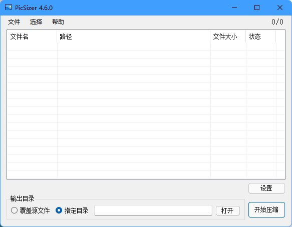
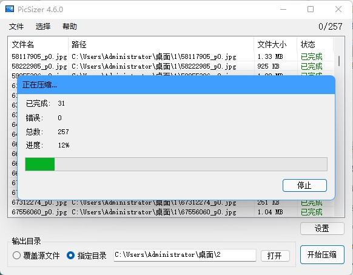
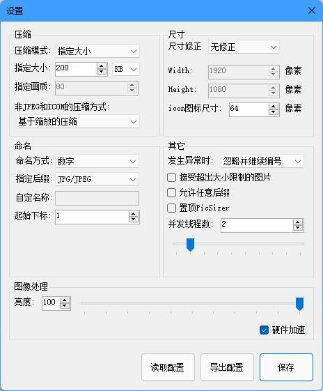

## 项目介绍(v4.6.0)

PicSizer是一款图片批量压缩软件，解决了传统压缩软件只能指定压缩比，而不能指定压缩后的大小的问题。

在网页中，图片需要尽可能占用更少的带宽，盲目使用画质作为唯一标准来压缩图片的后果是大图片压缩后仍然较大，而小图片越压缩越模糊。PicSizer可以在尽可能保证图片质量的情况下，将图片尽可能压缩到指定的大小，例如200KB。对大图片降低画质，对小图片仅转码而不改变画质，可以满足大部分需求。

由于本软件是专门用于网站图片压缩，因此相关设置、算法等都是基于网页图片显示方式来考虑的，对于其它情况可能并不适用甚至适得其反。

## PicSizer的优势

### 注重效率

- 通过二分查找来计算符合条件的最高画质
- 使用内存流读写的方法来避免文件读写时的低效
- 支持最多10个线程来充分使用CPU的性能
- 使用CUDA在英伟达GPU上为图形处理加速

### 使用方便

- 整个程序仅不到 1MB 的体积，没有多余的装饰，专注于实际体验
- 绿色软件，无需安装。运行过程中仅会往临时目录解压调用GPU所需的dll，除此之外不会主动创建或修改任何文件，不会尝试后台运行
- 开门见山，没有花哨的欢迎语等任何弹出式消息，直奔主题

## 下载与使用

### 下载地址

[PicSizer发行版(x64)](https://gitee.com/dearxuan/pic-sizer/releases)

### 界面截图

## 压缩方式

PicSizer可以读取的格式很多，但是支持的输出格式只有JPEG, PNG, BMP, TIFF四个，并且会自动调整压缩策略。

### 基于画质的压缩

如果输出的格式为JPEG，则会基于画质压缩，也就是在0~100之间选取符合条件的最高画质。

### 基于缩放的压缩

如果输出的格式不是JPEG，由于其它格式的文件并没有提供可调节的压缩参数，所以最终生成的文件大小只和尺寸有关。因此程序会在修正后的尺寸的基础上，适当地按比例缩小，直到生成的图片大小符合要求。

## 功能说明

### 批量增删图片

PicSizer支持每次打开同一目录下的图片或通过拖拽的方式将图片拖入窗体，并将生成的图片保存至指定目录。如果指定的目录不存在，会自动生成；如果目录中已经有文件，则同名文件将会被直接替换而不事先警告。

增加图片时会自动将地址与列表中的地址比对，如果已存在，则会跳过，并在添加完成后提示有几张图片被跳过。

使用 SHIFT 或 CTRL 来辅助多选，使用 Crtl+A 全选列表， Ctrl+R 反选列表，使用 BackSpace 或 Delete 来删除选中项。

### 尺寸修正

PicSizer可以把图片按比例缩放(也可以选择不缩放)，甚至破坏原图的比例。修正共有4种模式: 无修正，不小于限定值， 不大于限定值和强制修正。

由于Icon图标的特殊性，因此ico图片与其它格式的图片修正方式相互独立，一律采用强制修正

#### 无修正

将图片按照原图尺寸输出。

#### 不小于限定值

在保持宽度和高度不小于给定值的情况下，尽可能按比例缩小图片。例如，给定 400×300 的尺寸，而图片的尺寸为 800×800，则修正后的尺寸为 400×400。

如果图片的宽或高已经小于给定尺寸，则图片不会被修正。

#### 不大于限定值

在保持宽度和高度不大于给定值的情况下，尽可能按比例放大图片。例如，给定 400×300 的尺寸，而图片的尺寸为 100×100，则修正后的尺寸为 300×300。

如果图片的宽或高已经大于给定尺寸，则图片不会被修正。

#### 强制修正

图片会被强制缩放到你指定的尺寸，即使这会破坏图片原有比例。

#### 居中裁剪

严格按照给定的宽度和高度输出图片，多余的部分将被删除，如果图片太大或太小，则会先被缩放到合适的尺寸再裁剪。

例如: 图片的原尺寸为 600×500，而限制尺寸为 1000×1000，则图片会先被放大到 1200×1000，然后再裁剪掉两边。

### 压缩方式

#### 指定画质(仅JPEG)

PicSizer将画质划分为101个等级，从 0 到 100，数字越小表示画质越低。

对同一张图来说，画质通常和压缩率成正比，即画质越低，压缩率越低，图片越小。但是对不同图片来说，相同的画质可能会有不同的压缩率。

大图片在压缩后仍然可能占用较大空间，小图片虽然画质已经很低，但是仍然会被压缩，导致画质更低。

#### 指定大小

在尽可能确保图片质量的情况下，将图片压缩到不超过指定大小的大小。

例如，限定大小为200KB，则压缩后的图片可能是200KB，也可能是196KB。PicSizer通过二分查找的方法，在所有画质中寻找符合条件的最高画质，因此你不必担心图片画质过低。

当改变图片格式时，可能会出现压缩后大小比源文件更大。例如从有损压缩(\*.jpg)转到无损压缩(\*.png)。

#### 特殊格式的压缩

对于ICON图标，由于其尺寸是固定的，因此一律采用“基于位深度的压缩”。

对于其它非JPEG和ICON的图片，由于图片本身没有提供可调节的压缩参数，因此只能从“尺寸”和“位深度”两方面进行调整。

##### 基于缩放的压缩(推荐)

缩小图片的尺寸，直到其满足限制的文件大小。例如一张PNG图片的原本尺寸是 1000×1000，而限制尺寸为 500×500，则该图片会首先被缩放到 500×500 的大小，如果此时的文件大小仍然大于指定的大小，则会继续按比例缩放，直到找到符合要求的最大尺寸。因此这种方式输出的图片尺寸是不固定的，但是在网页上，浏览器可以自动缩放任意尺寸的图片，因此你不必担心图片尺寸会对网页内容造成影响。

该方案的优点是保留了图片本身的颜色，缺点是放大后的图片会变模糊。

##### 基于位深度的压缩

通过修改图片的位深度来减小图片体积。这种方法会改变图片的色域，让其显示更少的颜色。

该方案的优点是保护了了图片的尺寸，缺点是图片的颜色会被改变。

##### 两种方案的比较

你可以将图片下载到本地以仔细查看

<table width="100%">
    <tr>
        <th width="30%">
            
        </th>
        <th width="30%">
            
        </th>
        <th width="30%">
            
        </th>
    </tr>
    <tr>
        <th width="30%">
            原图(JPEG,842KB)
        </th>
        <th width="30%">
            基于缩放的压缩(PNG,132KB)
        </th>
        <th width="30%">
            基于位深度的压缩(PNG,136KB)
        </th>
    </tr>
</table>

### 命名

命名方式可以决定输出后的图片文件名。注意命名和后缀是分开考虑的，例如图片原名为 pic.png，选择的命名方式为“原名”，但是指定格式为“TIFF”，则最终输出的文件名是 “pic.tiff”。

#### 覆盖源文件

如果你选中了“覆盖源文件”，则下面的命名方式会被屏蔽，并且生成的图片会直接覆盖源文件。请做好备份工作。

#### 数字

使用数字来命名输出后的文件，如 1.jpg, 2.jpg ...... n.jpg

你可以指定下标的起始位置，如果其中一张图片生成失败，则下标不会增加。

例如，在生成 1.jpg 后，第二张图片生成失败，则第三张图片将会被，命名成 2.jpg。

#### 原名

使用原名来命名文件名，注意原名不包括后缀，你可以只修改后缀而不修改原名。

#### 混合方式

混合方式提供了自定义的方法来决定文件名，文件名将会使用你指定的字符串来生成，字符串替换方式如下:

- **{ori}** &nbsp;&nbsp;&nbsp;&nbsp;-> 源文件名(不包含后缀)
- **{num}** &nbsp;-> 下标

例如，指定字符串为 “a0{num}a1”，指定起始下标为 -5，则生成的文件名将会是 “a0-5a1.jpg”，“a0-4a1.jpg”......“a04a1.jpg”，“a05a1.jpg”。

如果源文件为 “abc.jpg”，指定字符串为 “x{ori}x”，则生成的文件名将会是 “xabcx.jpg” 。

如果两个关键字都出现了或者出现了多次，则每次出现的位置都会被替换。

注意不要使用不能作为文件名的字符，例如“\”，否则将会生成失败。

### 异常处理

如果图片无论如何也无法压缩到你指定的大小，则会抛出“图片压缩后仍较大”异常，你可以勾选“接受超出大小限制的图片”，这样当再次遇到该情况时，PicSizer就会输出力所能及的最小文件大小，即便它是不符合要求的。

除上述异常以外的其它异常，PicSizer支持5种处理方法。

#### 忽略并继续编号

不弹出错误界面，并且不更新编号值。

例如，生成2.jpg时出错，则下一个文件会被命名为2.jpg。

#### 忽略并跳过编号

不弹出错误界面，并且更新编号值。

例如，生成2.jpg时出错，则下一个文件会被命名为3.jpg。

#### 显示错误并继续编号

弹出错误界面，并且不更新编号值。

例如，生成2.jpg时出错，则先弹出错误界面，且下一个文件会被命名为2.jpg。

#### 显示错误并跳过编号

弹出错误界面，并且更新编号值。

例如，生成2.jpg时出错，则先弹出错误界面，且下一个文件会被命名为3.jpg。

#### 显示错误并立即结束

弹出错误界面，并且结束压缩。

例如，生成2.jpg时出错，则会先弹出错误界面，然后结束压缩。

### 多线程

PicSizer支持最多10个线程同时处理图片，但是默认只使用2个线程，因为过多的线程会导致大量IO和程序卡顿。

你可以在设置里修改并发线程数。

### 配置文件

你可以将配置文件导出以便下次快速修改相关设置。

配置文件的后缀是 “.pics”，但是即使被修改了也不影响导入。

点击“导出配置”按钮后可以选择导出的文件名，点击“读取配置”可以打开一个文件来读取，也可以直接拖入配置文件到设置窗体。

如果配置文件对应的设置的版本(并非PicSizer版本)与当前版本不同，则会弹窗警告，你可以尝试强制导入，通常高版本可以导入低版本，但是可能会有例外。

### 硬件加速

在调整图片亮度时，如果你拥有英伟达显卡，则可以使用GPU对图像处理进行加速。