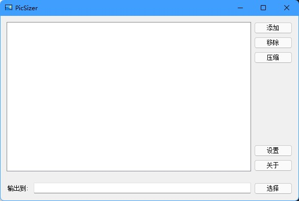
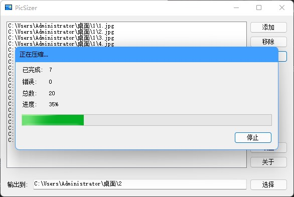
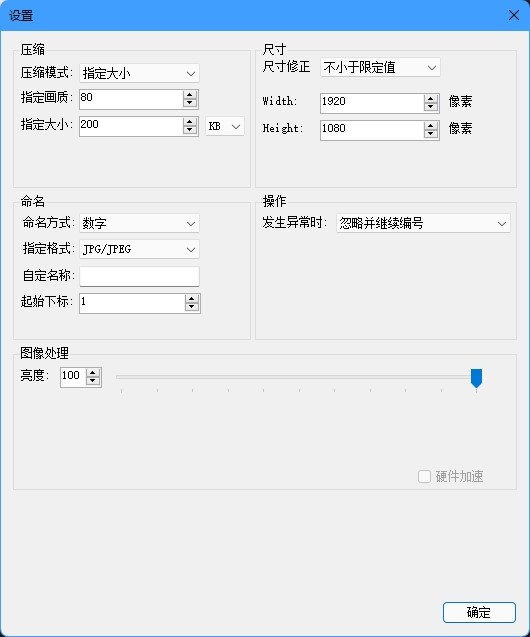

## 项目介绍

PicSizer是一款图片批量压缩软件，解决了传统压缩软件只能指定压缩比，而不能指定压缩后的大小的问题。

## 使用截图

## 下载与使用

[PicSizer发行版](https://gitee.com/dearxuan/pic-sizer/releases)

## 适用场合

编写PicSizer的最初目的是用来制作网页图片，因为网页图片需要尽可能占用更少的带宽，盲目使用画质作为唯一标准来压缩图片的后果是大图片压缩后仍然较大，而小图片越压缩越模糊。PicSizer可以在尽可能保证图片质量的情况下，将图片压缩到指定的大小，例如200KB。对大图片降低画质，对小图片仅转码而不改变画质，可以满足大部分需求。

## 功能说明

### 批量增删图片

PicSizer支持每次打开同一目录下的图片文件，并将生成的图片保存至指定目录。如果指定的目录不存在，会自动生成；如果目录中已经有文件，则同名文件将会被直接替换而不事先警告。

增加图片时会自动将地址与列表中的地址比对，如果已存在，则会跳过，并在添加完成后提示有几张图片被跳过。

使用 SHIFT 或 CTRL 来辅助多选，可以批量删除列表中的图片。

### 支持多种格式

PicSizer支持的格式有 \*.jpg , \*.png , \*.bmp , \*.tiff

### 尺寸修正

PicSizer可以把图片按比例缩放(也可以选择不缩放)，但是不支持破坏原图的比例。修正共有3种模式: 无修正，不小于限定值， 不大于限定值。

#### 无修正

将图片按照原图尺寸输出。

#### 不小于限定值

在保持宽度和高度不小于给定值的情况下，尽可能按比例缩小图片。例如，给定 400×300 的尺寸，而图片的尺寸为 800×800 ，则修正后的尺寸为 400×400。

如果图片的宽或高已经小于给定尺寸，则图片不会被修正。

#### 不大于限定值

在保持宽度和高度不大于给定值的情况下，尽可能按比例放大图片。例如，给定 400×300 的尺寸，而图片的尺寸为 100×100 ，则修正后的尺寸为 300×300。

如果图片的宽或高已经大于给定尺寸，则图片不会被修正。

### 压缩方式

#### 指定画质

PicSizer将画质划分为101个等级，从 0 到 100，数字越小表示画质越低。

对同一张图来说，画质通常和压缩率成正比，即画质越低，压缩率越低，图片越小。但是对不同图片来说，相同的画质可能会有不同的压缩率。

大图片在压缩后仍然可能占用较大空间，小图片虽然画质已经很低，但是仍然会被压缩，导致画质更低。

#### 指定大小

在尽可能确保图片质量的情况下，将图片压缩到不超过指定大小的大小。

例如，限定大小为200KB，则压缩后的图片可能是200KB，也可能是196KB。PicSizer通过二分查找的方法，在所有画质中寻找符合条件的最高画质，因此你不必担心图片画质过低。

### 命名方式

命名方式可以决定输出后的图片文件名。注意命名和后缀是分开考虑的，例如图片原名为 pic.png，选择的命名方式为“原名”，但是指定格式为“TIFF”，则最终输出的文件名是 “pic.tiff”。

#### 数字

使用数字来命名输出后的文件，如 1.jpg, 2.jpg ...... n.jpg

你可以指定下标的起始位置，如果其中一张图片生成失败，则下标不会增加。

例如，在生成 1.jpg 后，第二张图片生成失败，则第三张图片将会被，命名成 2.jpg。

#### 原名

使用原名来命名文件名，注意原名不包括后缀，你可以只修改后缀而不修改原名。

#### 混合方式

混合方式提供了自定义的方法来决定文件名，文件名将会使用你指定的字符串来生成，但是字符串其中必须存在 “{0}” ，它将会被替换成数字，你可以修改它的起始下标。

例如，指定字符串为 “a0{0}a1”，指定起始下标为 -5，则生成的文件名将会是 “a0-5a1.jpg”，“a0-4a1.jpg”......“a04a1.jpg”，“a05a1.jpg”。

如果出现了多个“{0}”，则所有的“{0}”都会被替换掉。

注意不要使用不能作为文件名的字符，例如“\”，否则将会生成失败。

### 异常处理

目前PicSizer不提供自定义处理异常的方式，遇到异常时，将会被跳过，且下标不会增加，也不会提示具体哪个文件出错。只会在压缩完成后提示生成失败的图片个数。

## 后序计划

- [x] 自定义文件名
- [x] 允许强制修正尺寸
- [x] 动态添加和删除文件或文件夹
- [x] 完善异常提示信息
- [x] 自定义遇到异常时的处理方式
- [x] 对生成后的图片做简易的图形处理(亮度)
- [ ] 加入硬件加速功能(将不再支持32位系统)