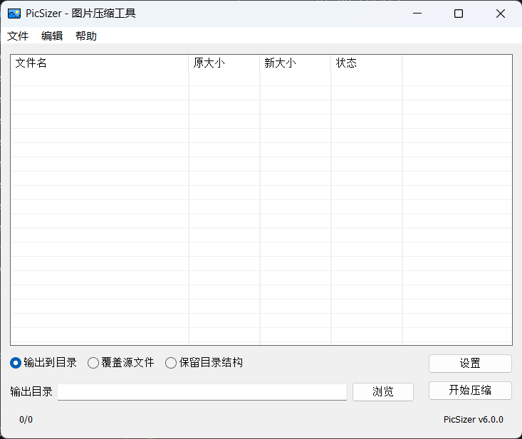
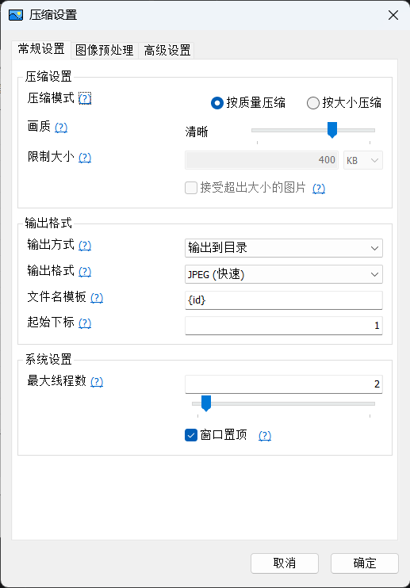

# PicSizer

# 项目介绍 (v6.0.0)

PicSizer 是一款图片批量压缩软件, 解决了传统压缩软件只能指定压缩比, 而不能指定压缩后的大小的问题

在网页中, 图片需要尽可能占用更少的带宽, 盲目使用画质作为唯一标准来压缩图片的后果是大图片压缩后仍然较大, 而小图片越压缩越模糊. PicSizer 可以在尽可能保证图片质量的情况下, 将图片尽可能压缩到指定的大小, 例如 200 KB. 对大图片降低画质, 对小图片仅转码而不改变画质, 可以满足大部分需求

## 相比上一代 (v5.0.0)

- 使用 Go 语言重写, 尽管体积有所增加 (约 10 MB), 但不再依赖 .Net 环境, 真正实现下载即可用
- 支持控制台运行 (需使用 CLI 版本, 同时体积更小)
- 对 PNG, WebP 图片有了更好的支持

## 图形界面

<table>
    <tr>
        <td>
            
        </td>
        <td>
            
        </td>
    </tr>
    <tr>
        <th>
            主界面
        </th>
        <th>
            设置界面
        </th>
    </tr>
</table>

## 效果预览

<table width="100%">
  <tr>
    <td colspan="3" align="center" valign="top">
      
      
原图 PNG, 3.18 MB

    </td>
  </tr>
  <tr>
    <td width="33.33%" align="center" valign="top">
      
      
JPEG, 画质选项: 清晰, 430 KB

    </td>
    <td width="33.33%" align="center" valign="top">
      
      
PNG, 画质选项: 清晰, 1.16 MB

    </td>
    <td width="33.33%" align="center" valign="top">
      
      
WebP, 画质选项: 清晰, 522 KB

    </td>
  </tr>
</table>

## 下载

[转到 Gitee 下载](https://gitee.com/dearxuan/pic-sizer/releases)

[转到 GitHub 下载](https://github.com/DearXuan7392/PicSizer/releases/)

## 开始使用

### 支持的格式

- 当前支持读取: **JPEG, PNG, WebP**
- 当前支持存为: **JPEG, PNG, WebP**

### 参数设置

下方已列出常用设置项说明, 其他设置项请在程序中点击 "?" 查看

<table>
  <thead>
    <tr>
      <th>设置名</th>
      <th>默认值</th>
      <th>可选项</th>
      <th>说明</th>
    </tr>
  </thead>
  <tbody>
    <!-- 压缩模式 -->
    <tr>
      <td rowspan="2">压缩模式</td>
      <td rowspan="2">按质量压缩</td>
      <td>按质量压缩</td>
      <td>指定输出画质, 速度较快</td>
    </tr>
    <tr>
      <td>按文件大小压缩</td>
      <td>限制压缩后文件大小, 由程序自动计算最佳画质, 但更耗时, 特别是 PNG 和 WebP 格式</td>
    </tr>
    <!-- 接受超出大小的图片 -->
    <tr>
      <td rowspan="2">接受超出大小的图片</td>
      <td rowspan="2">否</td>
      <td>是</td>
      <td>对于无法压缩到指定大小以内的图片, 仍然输出所能达到的体积最小的文件</td>
    </tr>
    <tr>
      <td>否</td>
      <td>无法压缩到指定大小以内的图片会直接报错</td>
    </tr>
    <!-- 输出方式 -->
    <tr>
      <td rowspan="3">输出方式</td>
      <td rowspan="3">输出到目录</td>
      <td>覆盖源文件</td>
      <td>直接覆盖源文件, 需做好备份. 若图片实际编码与后缀名不同, 会以后缀名为准 (例如图片名为 a.jpg 但使用 PNG 编码, 则会被修改为 JPEG 编码)</td>
    </tr>
    <tr>
      <td>输出到目录</td>
      <td>将图片全部输出到单个文件夹内</td>
    </tr>
    <tr>
      <td>保留目录结构</td>
      <td>将文件按原始的相对位置输出到新的文件夹中, 例如:<ul><li>/a/b/1.jpg  ==>  /output/b/1.jpg</li><li>/a/c/2.jpg  ==>  /output/c/2.jpg</li></ul></td>
    </tr>
    <!-- 输出格式 -->
    <tr>
      <td rowspan="4">输出格式</td>
      <td rowspan="4">JPEG</td>
      <td>JPEG</td>
      <td rowspan="4">当选择原格式时, 若图片实际格式与后缀名不同, 会以后缀名为准, 自动调整编码方式</td>
    </tr>
    <tr>
      <td>PNG</td>
    </tr>
    <tr>
      <td>WebP</td>
    </tr>
    <tr>
      <td>原格式</td>
    </tr>
    <!-- 文件名模板 -->
    <tr>
      <td rowspan="3">文件名模板</td>
      <td rowspan="3">{id}</td>
      <td>{id}</td>
      <td rowspan="3">文件名模板(不含后缀)指定了输出图片的命名规则, 替换规则如下: <ul><li>{id} 被替换为程序自动分配的索引数字</li><li>{name} 被替换为原始文件名</li></ul>若模板中没有{id}和{name}, 则可能出现图片被覆盖</td>
    </tr>
    <tr>
      <td>{name}</td>
    </tr>
    <tr>
      <td>任意自定义字符串</td>
    </tr>
    <!-- 缩放方式 -->
    <tr>
      <td rowspan="6">缩放方式</td>
      <td rowspan="6">无操作</td>
      <td>无操作</td>
      <td>按原图尺寸输出</td>
    </tr>
    <tr>
      <td>强制拉伸</td>
      <td>破坏原图比例, 强制拉伸到指定大小</td>
    </tr>
    <tr>
      <td>等比外接</td>
      <td>保持原图比例, 缩放至指定尺寸的最小外接矩形 (宽和高都大于等于指定尺寸)</td>
    </tr>
    <tr>
      <td>等比内接</td>
      <td>保持原图比例, 缩放至指定尺寸的最大内接矩形 (宽和高都小于等于指定尺寸)</td>
    </tr>
    <tr>
      <td>等比外接+裁剪</td>
      <td>保持原图比例, 缩放至指定尺寸的最小外接矩形后, 居中裁剪</td>
    </tr>
    <tr>
      <td>等比锁定单边</td>
      <td>保持原图比例, 将其中一条边缩放至指定大小, 另一条边自适应调整</td>
    </tr>
    <!-- 透明通道处理 -->
    <tr>
      <td rowspan="3">透明通道处理</td>
      <td rowspan="3">保留</td>
      <td>保留</td>
      <td>输出图片保留透明度通道</td>
    </tr>
    <tr>
      <td>智能移除</td>
      <td>当存在透明或半透明像素时, 保留透明度通道; 仅在图片全部为不透明像素时移除透明度通道</td>
    </tr>
    <tr>
      <td>全部移除</td>
      <td>使用白色底色叠加, 并移除透明度通道(半透明图片会变为白底不透明图片)</td>
    </tr>
  </tbody>
</table>

## 命令行运行 (CLI)

转到 [CLI.md](cli.md) 以查看相关说明

## 局限性

- 本程序将图片统一转为位图格式后进行处理, 对 JPEG 图片和部分 WebP 图片会造成轻微的色彩偏差.
- 本程序不支持灰度图, 会全部以 RGB 格式处理, 生成的图片可能比原图更大.
- 对于索引编码的 PNG 图片, 其本身体积已较小, 压缩后可能导致体积增大.

## 开源协议

本项目采用 [Apache-2.0 协议](LICENSE) 开源.

### 第三方组件声明
本项目包含第三方开源组件 (包括 Apache-2.0, MIT 和 BSD-3-Clause 协议的库). 有关完整的第三方软件归属、声明和许可协议列表，请参阅 [CREDITS.md](CREDITS.md) 或发布包中的 `THIRD_PARTY_LICENSES` 文件夹。
